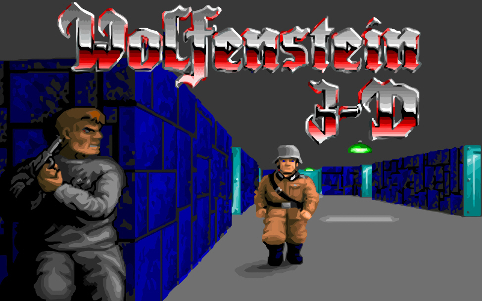

<div id="top"></div>
<p align=center>
  
  
  
</p>

<!-- PROJECT LOGO -->
<br />
<div align="center" style="height:200px; margin-bottom:10%">
  <a>
    
  </a>
</div>

<!-- TABLE OF CONTENTS -->
<summary>Table of Contents</summary>
<ol>
<li>
	<a href="#about-the-project">About The Project</a>
	<ul>
	<li><a href="#built-with">Built With</a></li>
	</ul>
</li>
<li>
	<a href="#getting-started">Getting Started</a>
	<ul>
	<li><a href="#prerequisites">Prerequisites</a></li>
	<li><a href="#installation">Installation</a></li>
	</ul>
</li>
<li><a href="#usage">Usage</a></li>
<li><a href="#roadmap">Roadmap</a></li>
<li><a href="#contact">Contact</a></li>
<li><a href="#acknowledgments">Acknowledgments</a></li>
</ol>
</details>

<!-- ABOUT THE PROJECT -->
## Demo (click the image to watch the demo)
<div align="center" style="height:200px; margin-bottom:10%">
  <a>
	  
</div>
<!-- TODO Put images from the project here -->

## About The Project

cub3D is a 42 project, aiming to create a Wolfenstein3D like game using only C with limited authorized librairies. You can find complete subject <a href="docs/">here</a>.

### Built With

* <a href="https://en.wikipedia.org/wiki/C_(programming_language)" target="_blank" title="C's wikipedia's page">C</a>
* <a href="https://github.com/42Paris/minilibx-linux" target="_blank" title="minilibx's repository">minilibx</a>

<!-- GETTING STARTED -->
## Getting Started

### Prerequisites

* [gcc](https://gcc.gnu.org/)
* [make](https://www.gnu.org/software/make/)
* [minilibx](https://github.com/42Paris/minilibx-linux)

### Installation

1. Clone the repo

   ```sh
   git clone https://github.com/kema-dev/cub3D.git
   ```

2. Go to repository's folder

   ```sh
   cd cub3D
   ```

3. Generate the executable

   ```sh
   make
   ```

<!-- USAGE EXAMPLES -->
## Usage

1. Launch the executable with a map as an argument
  You can use "map.cub" which already exists in the repository, but feel free to test other maps (you can find map making instructions in the subject <a href="docs/">here</a>)

   ```sh
   ./cub3D <your_map>
   ```

<!-- ROADMAP -->
## Roadmap

* The project is finished and no further work is planned on it

See the [open issues](https://github.com/kema-dev/cub3D/issues) for a full list of proposed features (and known issues).

<!-- CONTACT -->
## Contact

kema-dev - [GitHub](https://github.com/kema-dev)

## Acknowledgments

* [Img Shields](https://shields.io)
* [README.MD-Template](https://github.com/othneildrew/Best-README-Template)
